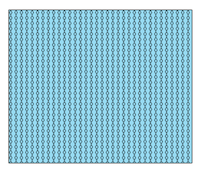

# CIM Symbol JSON

The following symbol JSON can be used in the `data.symbol` property of the CIM Symbol class.

```js
const cimSymbol = new CIMSymbol({
    data: {
        type: "CIMSymbolReference",
        symbol: // enter symbol JSON here!!
    }
})
```

Or, if you are autocasting the CIM symbol on the renderer, it will look something like this:

```js
featureLayer.renderer = {
    type: "simple",
    symbol: {
        type: "cim",
        data: {
            type: "CIMSymbolReference",
            symbol: // enter symbol JSON here!! 
        }
    }
}
```

Here's the links to the different symbols in case you want to skip ahead 😊
- [CIM Symbol JSON](#cim-symbol-json)
  - [Point Symbols](#point-symbols)
    - [CIM Picture Marker](#cim-picture-marker)
    - [CIM Vector Marker](#cim-vector-marker)
    - [Vector Marker with Text](#vector-marker-with-text)
  - [Line symbols](#line-symbols)
    - [CIM Solid Stroke](#cim-solid-stroke)
    - [CIM Picture Line](#cim-picture-line)
    - [Geometric Effects - Dashes](#geometric-effects---dashes)
    - [Geometric Effects - Buffer](#geometric-effects---buffer)
    - [Geometric Effects - Arrows](#geometric-effects---arrows)
    - [Marker Placement - Star](#marker-placement---star)
    - [Marker Placement - Rectangles](#marker-placement---rectangles)
  - [Fill symbols](#fill-symbols)
    - [Solid fill](#solid-fill)
    - [Hatch fill](#hatch-fill)
    - [Picture fill](#picture-fill)
    - [Marker placement in polygon](#marker-placement-in-polygon)

## Point Symbols

### CIM Picture Marker


```json
{
  "type": "CIMPointSymbol",
  "symbolLayers": [
    {
      "type": "CIMPictureMarker",
      "enable": true,
      "anchorPoint": {
        "x": 0,
        "y": 0,
        "z": 0
      },
      "anchorPointUnits": "Relative",
      "dominantSizeAxis3D": "Y",
      "size": 40,
      "billboardMode3D": "FaceNearPlane",
      "invertBackfaceTexture": true,
      "scaleX": 1,
      "textureFilter": "Picture",
      "tintColor": [
        255,
        255,
        255,
        255
      ],
      "url": "https://logos-download.com/wp-content/uploads/2016/11/ESRI_logo_logotype.png"
    }
  ]
}
```

### CIM Vector Marker


```json
{
  "type": "CIMPointSymbol",
  "symbolLayers": [
    {
      "type": "CIMVectorMarker",
      "enable": true,
      "anchorPoint": {
        "x": 0,
        "y": 0,
        "z": 0
      },
      "anchorPointUnits": "Relative",
      "dominantSizeAxis3D": "Y",
      "size": 25,
      "billboardMode3D": "FaceNearPlane",
      "frame": {
        "xmin": 0,
        "ymin": 0,
        "xmax": 66,
        "ymax": 133
      },
      "markerGraphics": [
        {
          "type": "CIMMarkerGraphic",
          "geometry": {
            "rings": [
              [
                [
                  33,
                  132
                ],
                [
                  25.4,
                  131.6
                ],
                [
                  18.8,
                  130.3
                ],
                [
                  13.1,
                  128.2
                ],
                [
                  8.5,
                  125.3
                ],
                [
                  4.9,
                  121.5
                ],
                [
                  2.4,
                  117
                ],
                [
                  0.8,
                  111.6
                ],
                [
                  0.3,
                  105.4
                ],
                [
                  0.3,
                  35.8
                ],
                [
                  33,
                  1
                ],
                [
                  65.8,
                  35.8
                ],
                [
                  65.8,
                  105.4
                ],
                [
                  65.3,
                  111.6
                ],
                [
                  63.7,
                  117
                ],
                [
                  61.2,
                  121.5
                ],
                [
                  57.5,
                  125.3
                ],
                [
                  52.9,
                  128.2
                ],
                [
                  47.3,
                  130.3
                ],
                [
                  40.6,
                  131.6
                ],
                [
                  33,
                  132
                ]
              ],
              [
                [
                  33,
                  73
                ],
                [
                  29.9,
                  73.3
                ],
                [
                  26.8,
                  74.1
                ],
                [
                  24,
                  75.5
                ],
                [
                  21.4,
                  77.3
                ],
                [
                  19.2,
                  79.5
                ],
                [
                  17.4,
                  82.1
                ],
                [
                  16.1,
                  84.9
                ],
                [
                  15.3,
                  88
                ],
                [
                  15,
                  91.1
                ],
                [
                  16.3,
                  98.1
                ],
                [
                  20.2,
                  104.1
                ],
                [
                  26,
                  108.1
                ],
                [
                  33,
                  109.5
                ],
                [
                  35.9,
                  109.3
                ],
                [
                  38.6,
                  108.6
                ],
                [
                  41.3,
                  107.5
                ],
                [
                  43.7,
                  105.9
                ],
                [
                  45.8,
                  104.1
                ],
                [
                  47.7,
                  101.9
                ],
                [
                  49.1,
                  99.4
                ],
                [
                  50.2,
                  96.7
                ],
                [
                  50.8,
                  94
                ],
                [
                  51,
                  91.1
                ],
                [
                  50.7,
                  88
                ],
                [
                  49.9,
                  84.9
                ],
                [
                  48.6,
                  82.1
                ],
                [
                  46.8,
                  79.5
                ],
                [
                  44.6,
                  77.3
                ],
                [
                  42,
                  75.5
                ],
                [
                  39.2,
                  74.1
                ],
                [
                  36.1,
                  73.3
                ],
                [
                  33,
                  73
                ]
              ]
            ]
          },
          "symbol": {
            "type": "CIMPolygonSymbol",
            "symbolLayers": [
              {
                "type": "CIMSolidFill",
                "enable": true,
                "color": [
                  39,
                  129,
                  153,
                  255
                ]
              }
            ]
          }
        }
      ],
      "scaleSymbolsProportionally": true,
      "respectFrame": true,
      "clippingPath": {
        "type": "CIMClippingPath",
        "clippingType": "Intersect",
        "path": {
          "rings": [
            [
              [
                0,
                0
              ],
              [
                66,
                0
              ],
              [
                66,
                133
              ],
              [
                0,
                133
              ],
              [
                0,
                0
              ]
            ]
          ]
        }
      }
    },
    {
      "type": "CIMVectorMarker",
      "enable": true,
      "anchorPoint": {
        "x": 0,
        "y": 4.5
      },
      "anchorPointUnits": "Relative",
      "dominantSizeAxis3D": "Y",
      "size": 3,
      "billboardMode3D": "FaceNearPlane",
      "frame": {
        "xmin": 0,
        "ymin": 0,
        "xmax": 39.7,
        "ymax": 17
      },
      "markerGraphics": [
        {
          "type": "CIMMarkerGraphic",
          "geometry": {
            "rings": [
              [
                [
                  32.2,
                  0
                ],
                [
                  7.4,
                  0
                ],
                [
                  6,
                  0.2
                ],
                [
                  4.6,
                  0.6
                ],
                [
                  3.3,
                  1.4
                ],
                [
                  2.2,
                  2.5
                ],
                [
                  1.2,
                  3.8
                ],
                [
                  0.6,
                  5.2
                ],
                [
                  0.1,
                  6.8
                ],
                [
                  0,
                  8.5
                ],
                [
                  0.1,
                  10.2
                ],
                [
                  0.6,
                  11.8
                ],
                [
                  1.2,
                  13.2
                ],
                [
                  2.2,
                  14.5
                ],
                [
                  3.3,
                  15.6
                ],
                [
                  4.6,
                  16.4
                ],
                [
                  6,
                  16.8
                ],
                [
                  7.4,
                  17
                ],
                [
                  32.2,
                  17
                ],
                [
                  33.7,
                  16.8
                ],
                [
                  35.1,
                  16.4
                ],
                [
                  36.4,
                  15.6
                ],
                [
                  37.5,
                  14.5
                ],
                [
                  38.4,
                  13.2
                ],
                [
                  39.1,
                  11.7
                ],
                [
                  39.6,
                  10.2
                ],
                [
                  39.7,
                  8.5
                ],
                [
                  39.6,
                  6.8
                ],
                [
                  39.1,
                  5.3
                ],
                [
                  38.4,
                  3.8
                ],
                [
                  37.5,
                  2.5
                ],
                [
                  36.4,
                  1.4
                ],
                [
                  35.1,
                  0.6
                ],
                [
                  33.7,
                  0.2
                ],
                [
                  32.2,
                  0
                ]
              ]
            ]
          },
          "symbol": {
            "type": "CIMPolygonSymbol",
            "symbolLayers": [
              {
                "type": "CIMSolidStroke",
                "enable": true,
                "capStyle": "Round",
                "joinStyle": "Round",
                "lineStyle3D": "Strip",
                "miterLimit": 10,
                "width": 0,
                "color": [
                  0,
                  0,
                  0,
                  255
                ]
              },
              {
                "type": "CIMSolidFill",
                "enable": true,
                "color": [
                  170,
                  170,
                  170,
                  255
                ]
              }
            ]
          }
        }
      ],
      "scaleSymbolsProportionally": true,
      "respectFrame": true
    }
  ]
}
```

### Vector Marker with Text


```json
{
  "type": "CIMPointSymbol",
  "symbolLayers": [
    {
      "type": "CIMVectorMarker",
      "enable": true,
      "size": 10,
      "colorLocked": true,
      "anchorPointUnits": "Relative",
      "frame": {
        "xmin": -5,
        "ymin": -5,
        "xmax": 5,
        "ymax": 5
      },
      "markerGraphics": [
        {
          "type": "CIMMarkerGraphic",
          "geometry": {
            "x": 0,
            "y": 0
          },
          "symbol": {
            "type": "CIMTextSymbol",
            "fontFamilyName": "Arial",
            "fontStyleName": "Bold",
            "height": 10,
            "horizontalAlignment": "Center",
            "offsetX": 0,
            "offsetY": -22,
            "symbol": {
              "type": "CIMPolygonSymbol",
              "symbolLayers": [
                {
                  "type": "CIMSolidFill",
                  "enable": true,
                  "color": [
                    17,
                    56,
                    146,
                    255
                  ]
                }
              ]
            },
            "verticalAlignment": "Center",
            "font": {
              "family": "Arial",
              "decoration": "none",
              "style": "normal",
              "weight": "bold"
            }
          },
          "textString": "you are here!"
        }
      ],
      "scaleSymbolsProportionally": true,
      "respectFrame": true,
      "offsetY": 0
    },
    {
      "type": "CIMVectorMarker",
      "enable": true,
      "anchorPoint": {
        "x": 0,
        "y": 0,
        "z": 0
      },
      "anchorPointUnits": "Relative",
      "dominantSizeAxis3D": "Y",
      "size": 25,
      "billboardMode3D": "FaceNearPlane",
      "frame": {
        "xmin": 0,
        "ymin": 0,
        "xmax": 66,
        "ymax": 133
      },
      "markerGraphics": [
        {
          "type": "CIMMarkerGraphic",
          "geometry": {
            "rings": [
              [
                [
                  33,
                  132
                ],
                [
                  25.4,
                  131.6
                ],
                [
                  18.8,
                  130.3
                ],
                [
                  13.1,
                  128.2
                ],
                [
                  8.5,
                  125.3
                ],
                [
                  4.9,
                  121.5
                ],
                [
                  2.4,
                  117
                ],
                [
                  0.8,
                  111.6
                ],
                [
                  0.3,
                  105.4
                ],
                [
                  0.3,
                  35.8
                ],
                [
                  33,
                  1
                ],
                [
                  65.8,
                  35.8
                ],
                [
                  65.8,
                  105.4
                ],
                [
                  65.3,
                  111.6
                ],
                [
                  63.7,
                  117
                ],
                [
                  61.2,
                  121.5
                ],
                [
                  57.5,
                  125.3
                ],
                [
                  52.9,
                  128.2
                ],
                [
                  47.3,
                  130.3
                ],
                [
                  40.6,
                  131.6
                ],
                [
                  33,
                  132
                ]
              ],
              [
                [
                  33,
                  73
                ],
                [
                  29.9,
                  73.3
                ],
                [
                  26.8,
                  74.1
                ],
                [
                  24,
                  75.5
                ],
                [
                  21.4,
                  77.3
                ],
                [
                  19.2,
                  79.5
                ],
                [
                  17.4,
                  82.1
                ],
                [
                  16.1,
                  84.9
                ],
                [
                  15.3,
                  88
                ],
                [
                  15,
                  91.1
                ],
                [
                  16.3,
                  98.1
                ],
                [
                  20.2,
                  104.1
                ],
                [
                  26,
                  108.1
                ],
                [
                  33,
                  109.5
                ],
                [
                  35.9,
                  109.3
                ],
                [
                  38.6,
                  108.6
                ],
                [
                  41.3,
                  107.5
                ],
                [
                  43.7,
                  105.9
                ],
                [
                  45.8,
                  104.1
                ],
                [
                  47.7,
                  101.9
                ],
                [
                  49.1,
                  99.4
                ],
                [
                  50.2,
                  96.7
                ],
                [
                  50.8,
                  94
                ],
                [
                  51,
                  91.1
                ],
                [
                  50.7,
                  88
                ],
                [
                  49.9,
                  84.9
                ],
                [
                  48.6,
                  82.1
                ],
                [
                  46.8,
                  79.5
                ],
                [
                  44.6,
                  77.3
                ],
                [
                  42,
                  75.5
                ],
                [
                  39.2,
                  74.1
                ],
                [
                  36.1,
                  73.3
                ],
                [
                  33,
                  73
                ]
              ]
            ]
          },
          "symbol": {
            "type": "CIMPolygonSymbol",
            "symbolLayers": [
              {
                "type": "CIMSolidFill",
                "enable": true,
                "color": [
                  39,
                  129,
                  153,
                  255
                ]
              }
            ]
          }
        }
      ],
      "scaleSymbolsProportionally": true,
      "respectFrame": true,
      "clippingPath": {
        "type": "CIMClippingPath",
        "clippingType": "Intersect",
        "path": {
          "rings": [
            [
              [
                0,
                0
              ],
              [
                66,
                0
              ],
              [
                66,
                133
              ],
              [
                0,
                133
              ],
              [
                0,
                0
              ]
            ]
          ]
        }
      }
    },
    {
      "type": "CIMVectorMarker",
      "enable": true,
      "anchorPoint": {
        "x": 0,
        "y": 4.5
      },
      "anchorPointUnits": "Relative",
      "dominantSizeAxis3D": "Y",
      "size": 3,
      "billboardMode3D": "FaceNearPlane",
      "frame": {
        "xmin": 0,
        "ymin": 0,
        "xmax": 39.7,
        "ymax": 17
      },
      "markerGraphics": [
        {
          "type": "CIMMarkerGraphic",
          "geometry": {
            "rings": [
              [
                [
                  32.2,
                  0
                ],
                [
                  7.4,
                  0
                ],
                [
                  6,
                  0.2
                ],
                [
                  4.6,
                  0.6
                ],
                [
                  3.3,
                  1.4
                ],
                [
                  2.2,
                  2.5
                ],
                [
                  1.2,
                  3.8
                ],
                [
                  0.6,
                  5.2
                ],
                [
                  0.1,
                  6.8
                ],
                [
                  0,
                  8.5
                ],
                [
                  0.1,
                  10.2
                ],
                [
                  0.6,
                  11.8
                ],
                [
                  1.2,
                  13.2
                ],
                [
                  2.2,
                  14.5
                ],
                [
                  3.3,
                  15.6
                ],
                [
                  4.6,
                  16.4
                ],
                [
                  6,
                  16.8
                ],
                [
                  7.4,
                  17
                ],
                [
                  32.2,
                  17
                ],
                [
                  33.7,
                  16.8
                ],
                [
                  35.1,
                  16.4
                ],
                [
                  36.4,
                  15.6
                ],
                [
                  37.5,
                  14.5
                ],
                [
                  38.4,
                  13.2
                ],
                [
                  39.1,
                  11.7
                ],
                [
                  39.6,
                  10.2
                ],
                [
                  39.7,
                  8.5
                ],
                [
                  39.6,
                  6.8
                ],
                [
                  39.1,
                  5.3
                ],
                [
                  38.4,
                  3.8
                ],
                [
                  37.5,
                  2.5
                ],
                [
                  36.4,
                  1.4
                ],
                [
                  35.1,
                  0.6
                ],
                [
                  33.7,
                  0.2
                ],
                [
                  32.2,
                  0
                ]
              ]
            ]
          },
          "symbol": {
            "type": "CIMPolygonSymbol",
            "symbolLayers": [
              {
                "type": "CIMSolidStroke",
                "enable": true,
                "capStyle": "Round",
                "joinStyle": "Round",
                "lineStyle3D": "Strip",
                "miterLimit": 10,
                "width": 0,
                "color": [
                  0,
                  0,
                  0,
                  255
                ]
              },
              {
                "type": "CIMSolidFill",
                "enable": true,
                "color": [
                  170,
                  170,
                  170,
                  255
                ]
              }
            ]
          }
        }
      ],
      "scaleSymbolsProportionally": true,
      "respectFrame": true
    }
  ]
}
```

## Line symbols

### CIM Solid Stroke


```json
{
    "type": "CIMLineSymbol",
    "symbolLayers": [
      {
        "type": "CIMSolidStroke",
        "enable": true,
        "capStyle": "Butt",
        "joinStyle": "Round",
        "width": 3,
        "color": [
          255,
          0,
          0,
          255
        ]
      },
      {
        "type": "CIMSolidStroke",
        "enable": true,
        "capStyle": "Butt",
        "joinStyle": "Round",
        "width": 8,
        "color":[
          255,
          192,
          203,
          255
        ]
      }
    ]
  }
```

### CIM Picture Line


```json
{
    "type": "CIMLineSymbol",
    "symbolLayers": [{
      "type": "CIMPictureFill",
      "effects": [{
        "type": "CIMGeometricEffectBuffer",
        "size": 5
      }],
      "enable": true,
      "url": "data:image/bmp;base64,Qk0+CAAAAAAAAD4AAAAoAAAAgAAAAIAAAAABAAEAAAAAAAAIAABtCwAAbQsAAAIAAAACAAAA////\nAAAAAAD/////////////////////gACAAIAAgACAAIAAgACAAIAAgACAAIAAgACAAIAAgACAAIAA\ngACAAIAAgACAAIAAgACAAIAAgACAAIAAgACAAIAAgACAAIAAgACAAIAAgACAAIAAgACAAIAAgACA\nAIAAgACAAIAAgACAAIAAgACAAP////////////////////8AgACAAIAAgACAAIAAgACAAIAAgACA\nAIAAgACAAIAAgACAAIAAgACAAIAAgACAAIAAgACAAIAAgACAAIAAgACAAIAAgACAAIAAgACAAIAA\ngACAAIAAgACAAIAAgACAAIAAgACAAIAAgACAAIAAgACA/////////////////////4AAgACAAIAA\ngACAAIAAgACAAIAAgACAAIAAgACAAIAAgACAAIAAgACAAIAAgACAAIAAgACAAIAAgACAAIAAgACA\nAIAAgACAAIAAgACAAIAAgACAAIAAgACAAIAAgACAAIAAgACAAIAAgACAAIAAgAD/////////////\n////////AIAAgACAAIAAgACAAIAAgACAAIAAgACAAIAAgACAAIAAgACAAIAAgACAAIAAgACAAIAA\ngACAAIAAgACAAIAAgACAAIAAgACAAIAAgACAAIAAgACAAIAAgACAAIAAgACAAIAAgACAAIAAgACA\nAIAAgP////////////////////+AAIAAgACAAIAAgACAAIAAgACAAIAAgACAAIAAgACAAIAAgACA\nAIAAgACAAIAAgACAAIAAgACAAIAAgACAAIAAgACAAIAAgACAAIAAgACAAIAAgACAAIAAgACAAIAA\ngACAAIAAgACAAIAAgACAAIAA/////////////////////wCAAIAAgACAAIAAgACAAIAAgACAAIAA\ngACAAIAAgACAAIAAgACAAIAAgACAAIAAgACAAIAAgACAAIAAgACAAIAAgACAAIAAgACAAIAAgACA\nAIAAgACAAIAAgACAAIAAgACAAIAAgACAAIAAgACAAID/////////////////////gACAAIAAgACA\nAIAAgACAAIAAgACAAIAAgACAAIAAgACAAIAAgACAAIAAgACAAIAAgACAAIAAgACAAIAAgACAAIAA\ngACAAIAAgACAAIAAgACAAIAAgACAAIAAgACAAIAAgACAAIAAgACAAIAAgACAAP//////////////\n//////8AgACAAIAAgACAAIAAgACAAIAAgACAAIAAgACAAIAAgACAAIAAgACAAIAAgACAAIAAgACA\nAIAAgACAAIAAgACAAIAAgACAAIAAgACAAIAAgACAAIAAgACAAIAAgACAAIAAgACAAIAAgACAAIAA\ngACA/////////////////////4AAgACAAIAAgACAAIAAgACAAIAAgACAAIAAgACAAIAAgACAAIAA\ngACAAIAAgACAAIAAgACAAIAAgACAAIAAgACAAIAAgACAAIAAgACAAIAAgACAAIAAgACAAIAAgACA\nAIAAgACAAIAAgACAAIAAgAD/////////////////////AIAAgACAAIAAgACAAIAAgACAAIAAgACA\nAIAAgACAAIAAgACAAIAAgACAAIAAgACAAIAAgACAAIAAgACAAIAAgACAAIAAgACAAIAAgACAAIAA\ngACAAIAAgACAAIAAgACAAIAAgACAAIAAgACAAIAAgP////////////////////+AAIAAgACAAIAA\ngACAAIAAgACAAIAAgACAAIAAgACAAIAAgACAAIAAgACAAIAAgACAAIAAgACAAIAAgACAAIAAgACA\nAIAAgACAAIAAgACAAIAAgACAAIAAgACAAIAAgACAAIAAgACAAIAAgACAAIAA////////////////\n/////wCAAIAAgACAAIAAgACAAIAAgACAAIAAgACAAIAAgACAAIAAgACAAIAAgACAAIAAgACAAIAA\ngACAAIAAgACAAIAAgACAAIAAgACAAIAAgACAAIAAgACAAIAAgACAAIAAgACAAIAAgACAAIAAgACA\nAID/////////////////////gACAAIAAgACAAIAAgACAAIAAgACAAIAAgACAAIAAgACAAIAAgACA\nAIAAgACAAIAAgACAAIAAgACAAIAAgACAAIAAgACAAIAAgACAAIAAgACAAIAAgACAAIAAgACAAIAA\ngACAAIAAgACAAIAAgACAAP////////////////////8AgACAAIAAgACAAIAAgACAAIAAgACAAIAA\ngACAAIAAgACAAIAAgACAAIAAgACAAIAAgACAAIAAgACAAIAAgACAAIAAgACAAIAAgACAAIAAgACA\nAIAAgACAAIAAgACAAIAAgACAAIAAgACAAIAAgACA/////////////////////4AAgACAAIAAgACA\nAIAAgACAAIAAgACAAIAAgACAAIAAgACAAIAAgACAAIAAgACAAIAAgACAAIAAgACAAIAAgACAAIAA\ngACAAIAAgACAAIAAgACAAIAAgACAAIAAgACAAIAAgACAAIAAgACAAIAAgAD/////////////////\n////AIAAgACAAIAAgACAAIAAgACAAIAAgACAAIAAgACAAIAAgACAAIAAgACAAIAAgACAAIAAgACA\nAIAAgACAAIAAgACAAIAAgACAAIAAgACAAIAAgACAAIAAgACAAIAAgACAAIAAgACAAIAAgACAAIAA\ngA==",
      "scaleX": 1,
      "height": 96,
      "textureFilter": "Draft",
      "colorSubstitutions": [{
          "type": "CIMColorSubstitution",
          "oldColor": [
            0,
            0,
            0,
            255
          ],
          "newColor": [
            0,
            0,
            0,
            255
          ]
        },
        {
          "type": "CIMColorSubstitution",
          "oldColor": [
            255,
            255,
            255,
            255
          ],
          "newColor": [
            255,
            255,
            115,
            255
          ]
        }
      ]
    }]
  }
```

### Geometric Effects - Dashes


```json
{
    "type": "CIMLineSymbol",
    "symbolLayers": [{
        "type": "CIMSolidStroke",
        "effects": [{
            "type": "CIMGeometricEffectDashes",
            "dashTemplate": [
              0,
              5,
              5,
              0
            ],
            "lineDashEnding": "NoConstraint",
            "controlPointEnding": "NoConstraint"
          },
          {
            "type": "CIMGeometricEffectOffset",
            "method": "Rounded",
            "offset": -1.15,
            "option": "Fast"
          }
        ],
        "enable": true,
        "capStyle": "Butt",
        "joinStyle": "Round",
        "lineStyle3D": "Strip",
        "miterLimit": 10,
        "width": 2.3,
        "color": [
          0,
          0,
          0,
          255
        ]
      },
      {
        "type": "CIMSolidStroke",
        "effects": [{
            "type": "CIMGeometricEffectDashes",
            "dashTemplate": [
              5,
              5
            ],
            "lineDashEnding": "NoConstraint",
            "controlPointEnding": "NoConstraint"
          },
          {
            "type": "CIMGeometricEffectOffset",
            "method": "Rounded",
            "offset": 1.15,
            "option": "Fast"
          }
        ],
        "enable": true,
        "capStyle": "Butt",
        "joinStyle": "Round",
        "lineStyle3D": "Strip",
        "miterLimit": 10,
        "width": 2.3,
        "color": [
          0,
          0,
          0,
          255
        ]
      },
      {
        "type": "CIMSolidStroke",
        "enable": true,
        "capStyle": "Butt",
        "joinStyle": "Round",
        "lineStyle3D": "Strip",
        "miterLimit": 10,
        "width": 4.6,
        "color": [
          255,
          255,
          255,
          255
        ]
      },
      {
        "type": "CIMSolidStroke",
        "enable": true,
        "colorLocked": true,
        "capStyle": "Butt",
        "joinStyle": "Round",
        "lineStyle3D": "Strip",
        "miterLimit": 10,
        "width": 5,
        "color": [
          0,
          0,
          0,
          255
        ]
      }
    ]
  }
```

### Geometric Effects - Buffer


```json
{
    "type": "CIMLineSymbol",
    "symbolLayers": [
      {
        "type": "CIMSolidStroke",
        "effects": [{
          "type": "CIMGeometricEffectBuffer",
          "size": 10
        }],
        "enable": true,
        "capStyle": "Butt",
        "joinStyle": "Bevel",
        "miterLimit": 10,
        "width": 3,
        "color": [
          255,
          0,
          255,
          255
        ]
      }
    ]
}
```

### Geometric Effects - Arrows


```json
{
    "type": "CIMLineSymbol",
    "symbolLayers": [
      {
        "type": "CIMSolidStroke",
        "effects": [{
          "type": "CIMGeometricEffectArrow",
          "width": 10,
          "geometricEffectArrowType": "Block"
        }],
        "enable": true,
        "capStyle": "Butt",
        "joinStyle": "Round",
        "miterLimit": 10,
        "width": 3,
        "color": [135,206,235,255]
      }
    ]
  }
```

### Marker Placement - Star


```json
{
    "type": "CIMLineSymbol",
    "symbolLayers": [{
      "type": "CIMVectorMarker",
      "enable": true,
      "anchorPointUnits": "Relative",
      "dominantSizeAxis3D": "Z",
      "size": 10,
      "billboardMode3D": "FaceNearPlane",
      "markerPlacement": {
        "type": "CIMMarkerPlacementAlongLineSameSize",
        "angleToLine": true,
        "controlPointPlacement": "NoConstraint",
        "endings": "NoConstraint",
        "offsetAlongLine": 18.75,
        "placementTemplate": [
          19.5
        ]
      },
      "frame": {
        "xmin": -5,
        "ymin": -5,
        "xmax": 5,
        "ymax": 5
      },
      "markerGraphics": [{
        "type": "CIMMarkerGraphic",
        "geometry": {
          "x": 0,
          "y": 0
        },
        "symbol": {
          "type": "CIMPointSymbol",
          "haloSize": 0,
          "scaleX": 1,
          "angleAlignment": "Display",
          "symbolLayers": [{
              "type": "CIMVectorMarker",
              "enable": true,
              "colorLocked": true,
              "anchorPoint": {
                "x": 0,
                "y": 0.000013185654008462204
              },
              "anchorPointUnits": "Relative",
              "dominantSizeAxis3D": "Y",
              "rotation": -1.2789769243681803e-13,
              "size": 16,
              "billboardMode3D": "FaceNearPlane",
              "frame": {
                "xmin": -313,
                "ymin": -300,
                "xmax": 313,
                "ymax": 300
              },
              "markerGraphics": [{
                "type": "CIMMarkerGraphic",
                "geometry": {
                  "rings": [
                    [
                      [
                        -31,
                        21
                      ],
                      [
                        -128,
                        21
                      ],
                      [
                        -49,
                        -37
                      ],
                      [
                        -79,
                        -130
                      ],
                      [
                        0,
                        -72
                      ],
                      [
                        79,
                        -130
                      ],
                      [
                        49,
                        -37
                      ],
                      [
                        128,
                        21
                      ],
                      [
                        30,
                        21
                      ],
                      [
                        0,
                        113
                      ],
                      [
                        -31,
                        21
                      ]
                    ],
                    [
                      [
                        50,
                        47
                      ],
                      [
                        210,
                        47
                      ],
                      [
                        80,
                        -48
                      ],
                      [
                        130,
                        -200
                      ],
                      [
                        0,
                        -106
                      ],
                      [
                        -130,
                        -200
                      ],
                      [
                        -80,
                        -47
                      ],
                      [
                        -210,
                        47
                      ],
                      [
                        -50,
                        47
                      ],
                      [
                        0,
                        199
                      ],
                      [
                        50,
                        47
                      ]
                    ]
                  ]
                },
                "symbol": {
                  "type": "CIMPolygonSymbol",
                  "symbolLayers": [{
                    "type": "CIMSolidFill",
                    "enable": true,
                    "colorLocked": true,
                    "color": [
                      0,
                      0,
                      0,
                      255
                    ]
                  }]
                }
              }],
              "respectFrame": true
            },
            {
              "type": "CIMVectorMarker",
              "enable": true,
              "anchorPoint": {
                "x": 0,
                "y": 0.000007727378100620778
              },
              "anchorPointUnits": "Relative",
              "dominantSizeAxis3D": "Y",
              "rotation": -1.2789769243681803e-13,
              "size": 16,
              "billboardMode3D": "FaceNearPlane",
              "frame": {
                "xmin": -310,
                "ymin": -300,
                "xmax": 310,
                "ymax": 300
              },
              "markerGraphics": [{
                "type": "CIMMarkerGraphic",
                "geometry": {
                  "rings": [
                    [
                      [
                        37,
                        48
                      ],
                      [
                        172,
                        48
                      ],
                      [
                        66,
                        -35
                      ],
                      [
                        108,
                        -165
                      ],
                      [
                        -2,
                        -84
                      ],
                      [
                        -109,
                        -164
                      ],
                      [
                        -67,
                        -35
                      ],
                      [
                        -172,
                        48
                      ],
                      [
                        -41,
                        48
                      ],
                      [
                        -2,
                        165
                      ],
                      [
                        37,
                        48
                      ]
                    ]
                  ]
                },
                "symbol": {
                  "type": "CIMPolygonSymbol",
                  "symbolLayers": [{
                    "type": "CIMSolidFill",
                    "enable": true,
                    "color": [
                      0,
                      255,
                      0,
                      255
                    ]
                  }]
                }
              }],
              "respectFrame": true
            }
          ]
        }
      }],
      "respectFrame": false
    }]
  }
```

### Marker Placement - Rectangles


```json
{
    "type": "CIMLineSymbol",
    "symbolLayers": [{
        "type": "CIMVectorMarker",
        "enable": true,
        "anchorPoint": {
          "x": 8.63053682149073e-9,
          "y": 0
        },
        "anchorPointUnits": "Relative",
        "dominantSizeAxis3D": "Y",
        "size": 10,
        "billboardMode3D": "FaceNearPlane",
        "markerPlacement": {
          "type": "CIMMarkerPlacementAlongLineSameSize",
          "angleToLine": true,
          "controlPointPlacement": "NoConstraint",
          "endings": "NoConstraint",
          "offsetAlongLine": 9.5,
          "placementTemplate": [
            20
          ]
        },
        "frame": {
          "xmin": -603,
          "ymin": -300,
          "xmax": 603,
          "ymax": 300
        },
        "markerGraphics": [{
          "type": "CIMMarkerGraphic",
          "geometry": {
            "rings": [
              [
                [
                  -254,
                  91
                ],
                [
                  -257,
                  89
                ],
                [
                  -259,
                  83
                ],
                [
                  -259,
                  -83
                ],
                [
                  -258,
                  -86
                ],
                [
                  -257,
                  -89
                ],
                [
                  -253,
                  -92
                ],
                [
                  -250,
                  -92
                ],
                [
                  249,
                  -92
                ],
                [
                  253,
                  -92
                ],
                [
                  256,
                  -90
                ],
                [
                  258,
                  -87
                ],
                [
                  258,
                  -83
                ],
                [
                  258,
                  83
                ],
                [
                  258,
                  86
                ],
                [
                  256,
                  89
                ],
                [
                  253,
                  91
                ],
                [
                  249,
                  92
                ],
                [
                  -250,
                  92
                ],
                [
                  -254,
                  91
                ]
              ],
              [
                [
                  249,
                  105
                ],
                [
                  254,
                  105
                ],
                [
                  258,
                  103
                ],
                [
                  262,
                  101
                ],
                [
                  265,
                  98
                ],
                [
                  268,
                  95
                ],
                [
                  270,
                  91
                ],
                [
                  271,
                  87
                ],
                [
                  271,
                  83
                ],
                [
                  271,
                  -83
                ],
                [
                  271,
                  -88
                ],
                [
                  270,
                  -92
                ],
                [
                  268,
                  -95
                ],
                [
                  265,
                  -99
                ],
                [
                  262,
                  -101
                ],
                [
                  258,
                  -103
                ],
                [
                  254,
                  -105
                ],
                [
                  249,
                  -105
                ],
                [
                  -250,
                  -105
                ],
                [
                  -254,
                  -105
                ],
                [
                  -258,
                  -103
                ],
                [
                  -262,
                  -101
                ],
                [
                  -265,
                  -99
                ],
                [
                  -268,
                  -95
                ],
                [
                  -270,
                  -92
                ],
                [
                  -271,
                  -88
                ],
                [
                  -272,
                  -83
                ],
                [
                  -272,
                  83
                ],
                [
                  -271,
                  87
                ],
                [
                  -270,
                  91
                ],
                [
                  -268,
                  95
                ],
                [
                  -265,
                  98
                ],
                [
                  -262,
                  101
                ],
                [
                  -258,
                  103
                ],
                [
                  -254,
                  105
                ],
                [
                  -250,
                  105
                ],
                [
                  249,
                  105
                ]
              ]
            ]
          },
          "symbol": {
            "type": "CIMPolygonSymbol",
            "symbolLayers": [{
              "type": "CIMSolidFill",
              "enable": true,
              "color": [
                0,
                77,
                168,
                255
              ]
            }]
          }
        }],
        "respectFrame": true
      },
      {
        "type": "CIMSolidStroke",
        "effects": [{
          "type": "CIMGeometricEffectDashes",
          "dashTemplate": [
            6,
            9,
            5,
            0
          ],
          "lineDashEnding": "NoConstraint",
          "controlPointEnding": "NoConstraint"
        }],
        "enable": true,
        "capStyle": "Butt",
        "joinStyle": "Round",
        "lineStyle3D": "Strip",
        "miterLimit": 10,
        "width": 1,
        "color": [
          0,
          77,
          168,
          255
        ]
      }
    ]
  }
```

## Fill symbols

### Solid fill


```json
{
    "type": "CIMPolygonSymbol",
    "symbolLayers": [{
        "type": "CIMSolidStroke",
        "effects": [{
          "type": "CIMGeometricEffectOffset",
          "method": "Rounded",
          "offset": -1.3,
          "option": "Fast"
        }],
        "enable": true,
        "capStyle": "Butt",
        "joinStyle": "Round",
        "lineStyle3D": "Strip",
        "miterLimit": 10,
        "width": 0.2,
        "color": [
          0,
          0,
          0,
          255
        ]
      },
      {
        "type": "CIMSolidStroke",
        "effects": [{
          "type": "CIMGeometricEffectOffset",
          "method": "Rounded",
          "offset": 1.3,
          "option": "Fast"
        }],
        "enable": true,
        "capStyle": "Butt",
        "joinStyle": "Round",
        "lineStyle3D": "Strip",
        "miterLimit": 10,
        "width": 0.2,
        "color": [
          0,
          0,
          0,
          255
        ]
      },
      {
        "type": "CIMSolidFill",
        "enable": true,
        "color": [
          248,
          252,
          179,
          255
        ]
      }
    ]
  }
```

### Hatch fill


```json
{
    "type": "CIMPolygonSymbol",
    "symbolLayers": [{
        "type": "CIMSolidStroke",
        "enable": true,
        "capStyle": "Round",
        "joinStyle": "Round",
        "lineStyle3D": "Strip",
        "miterLimit": 10,
        "width": 0.4,
        "color": [
          254,
          177,
          25,
          255
        ]
      },
      {
        "type": "CIMHatchFill",
        "enable": true,
        "lineSymbol": {
          "type": "CIMLineSymbol",
          "symbolLayers": [{
            "type": "CIMSolidStroke",
            "enable": true,
            "capStyle": "Butt",
            "joinStyle": "Miter",
            "lineStyle3D": "Strip",
            "miterLimit": 10,
            "width": 0.4,
            "color": [
              254,
              177,
              25,
              255
            ]
          }]
        },
        "offsetX": 0.9,
        "rotation": 90,
        "separation": 5
      },
      {
        "type": "CIMSolidStroke",
        "enable": true,
        "capStyle": "Butt",
        "joinStyle": "Miter",
        "lineStyle3D": "Strip",
        "miterLimit": 10,
        "width": 0,
        "color": [
          0,
          0,
          0,
          255
        ]
      },
      {
        "type": "CIMHatchFill",
        "enable": true,
        "lineSymbol": {
          "type": "CIMLineSymbol",
          "symbolLayers": [{
            "type": "CIMSolidStroke",
            "enable": true,
            "capStyle": "Butt",
            "joinStyle": "Miter",
            "lineStyle3D": "Strip",
            "miterLimit": 10,
            "width": 0.8,
            "color": [
              254,
              177,
              25,
              255
            ]
          }]
        },
        "rotation": 90,
        "separation": 5
      }
    ]
  }
```

### Picture fill


```json
{
    "type": "CIMPolygonSymbol",
    "symbolLayers": [{
        "type": "CIMSolidStroke",
        "enable": true,
        "capStyle": "Round",
        "joinStyle": "Round",
        "lineStyle3D": "Strip",
        "miterLimit": 10,
        "width": 0.4,
        "color": [
          109,
          187,
          67,
          255
        ]
      },
      {
        "type": "CIMPictureMarker",
        "enable": true,
        "anchorPointUnits": "Relative",
        "dominantSizeAxis3D": "Z",
        "size": 36,
        "billboardMode3D": "FaceNearPlane",
        "markerPlacement": {
          "type": "CIMMarkerPlacementInsidePolygon",
          "gridType": "Fixed",
          "offsetX": 5,
          "seed": 25604,
          "stepX": 52.75,
          "stepY": 26,
          "clipping": "ClipAtBoundary",
          "stdDeviationX": 26.375,
          "stdDeviationY": 13
        },
        "colorSubstitutions": [{
            "type": "CIMColorSubstitution",
            "oldColor": [
              0,
              0,
              0,
              255
            ],
            "newColor": [
              109,
              187,
              67,
              255
            ]
          },
          {
            "type": "CIMColorSubstitution",
            "oldColor": [
              255,
              255,
              255,
              255
            ],
            "newColor": [
              255,
              255,
              255,
              255
            ]
          }
        ],
        "invertBackfaceTexture": true,
        "scaleX": 1,
        "textureFilter": "Draft",
        "url": "data:image/bmp;base64,Qk2+AQAAAAAAAD4AAAAoAAAAOQAAADAAAAABAAEAAAAAAIABAAAAAAAAAAAAAAAAAAAAAAAAAAAA\nAP///wD2+33/nff/gOD4ff/Bh8GA3/+Nj/55vYC///G3//49gLDgBAf//cOAxuzv//8d/4DW48/+\nft3/gBCfMH2cHD4Af2B3vcH7voD/bfu+F/u9gMbMPD/zPDwAlh3Px/1f/4C3/dex/N//gIf4WZ4D\n4+eAvxtt4Pft24C+23P/8e3bgAbbf4/I8eIA0Bx/sB8/+oDd//+3v4/9gDh3g44/t/gAs5t78V+3\n4oC92LuG78fagD5/xi7h/7MA8fx+zO7/j4Du+34y7v/8gA77f4bgz/oA8ft/rvu3/ID/+P+df7fP\ngDAbw/2/g7cAt8vb/p/5toC2d9v+f/wOgDDw54//4f4A//sPr//N/oD8++9v/93OgPLz8B8PY7aA\n9uuF/u6/toD223X+3t/OgCDbZgAeXiAAn+cdvv8Nn4Df//3e//HYgIP/w8YHz+aAvB+7s3uv+IA+\n77u7e3efgN73x4OHZG4A3w/8f/9t3oC///u//5w+gD/4+D/D4f8A8ft9/733/4A="
      },
      {
        "type": "CIMSolidFill",
        "enable": true,
        "color": [
          255,
          255,
          255,
          255
        ]
      }
    ]
  }
```

### Marker placement in polygon



```json
{
    "type": "CIMPolygonSymbol",
    "symbolLayers": [{
        "type": "CIMSolidStroke",
        "enable": true,
        "colorLocked": true,
        "capStyle": "Round",
        "joinStyle": "Round",
        "lineStyle3D": "Strip",
        "miterLimit": 10,
        "width": 1,
        "color": [
          110,
          110,
          110,
          255
        ]
      },
      {
        "type": "CIMVectorMarker",
        "enable": true,
        "colorLocked": true,
        "anchorPointUnits": "Relative",
        "dominantSizeAxis3D": "Z",
        "size": 10,
        "billboardMode3D": "FaceNearPlane",
        "markerPlacement": {
          "type": "CIMMarkerPlacementInsidePolygon",
          "gridType": "Fixed",
          "seed": 25604,
          "stepX": 12,
          "stepY": 12,
          "clipping": "ClipAtBoundary",
          "stdDeviationX": 6,
          "stdDeviationY": 6
        },
        "frame": {
          "xmin": -5,
          "ymin": -5,
          "xmax": 5,
          "ymax": 5
        },
        "markerGraphics": [{
          "type": "CIMMarkerGraphic",
          "geometry": {
            "x": 0,
            "y": 0
          },
          "symbol": {
            "type": "CIMPointSymbol",
            "haloSize": 0,
            "scaleX": 1,
            "symbol3DProperties": {
              "type": "CIM3DSymbolProperties",
              "dominantSizeAxis3D": "Z",
              "scaleZ": 1,
              "scaleY": 1,
              "rotationOrder3D": "XYZ"
            },
            "angleAlignment": "Display",
            "symbolLayers": [{
              "type": "CIMVectorMarker",
              "enable": true,
              "colorLocked": true,
              "anchorPoint": {
                "x": 0,
                "y": 0.000012842465753379884
              },
              "anchorPointUnits": "Relative",
              "dominantSizeAxis3D": "Y",
              "size": 18,
              "billboardMode3D": "FaceNearPlane",
              "frame": {
                "xmin": -189,
                "ymin": -300,
                "xmax": 189,
                "ymax": 300
              },
              "markerGraphics": [{
                "type": "CIMMarkerGraphic",
                "geometry": {
                  "rings": [
                    [
                      [
                        -82,
                        -1
                      ],
                      [
                        0,
                        -151
                      ],
                      [
                        81,
                        -1
                      ],
                      [
                        0,
                        149
                      ],
                      [
                        -82,
                        -1
                      ]
                    ],
                    [
                      [
                        120,
                        -1
                      ],
                      [
                        0,
                        -210
                      ],
                      [
                        -120,
                        -1
                      ],
                      [
                        0,
                        210
                      ],
                      [
                        120,
                        -1
                      ]
                    ]
                  ]
                },
                "symbol": {
                  "type": "CIMPolygonSymbol",
                  "symbolLayers": [{
                    "type": "CIMSolidFill",
                    "enable": true,
                    "colorLocked": true,
                    "color": [
                      0,
                      0,
                      0,
                      255
                    ]
                  }]
                }
              }],
              "respectFrame": true
            }]
          }
        }],
        "respectFrame": false
      },
      {
        "type": "CIMSolidStroke",
        "enable": true,
        "capStyle": "Round",
        "joinStyle": "Round",
        "lineStyle3D": "Strip",
        "miterLimit": 10,
        "width": 0.4,
        "color": [
          64,
          101,
          235,
          255
        ]
      },
      {
        "type": "CIMSolidFill",
        "enable": true,
        "color": [
          151,
          219,
          242,
          255
        ]
      }
    ]
  }
```
