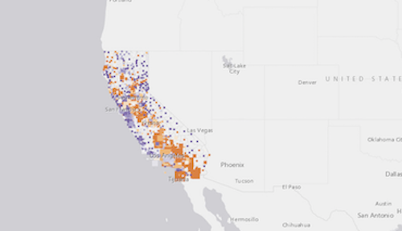
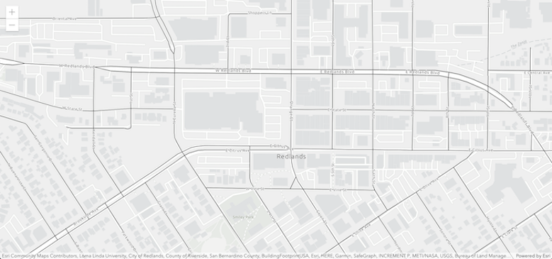
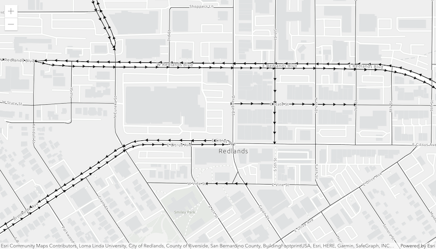
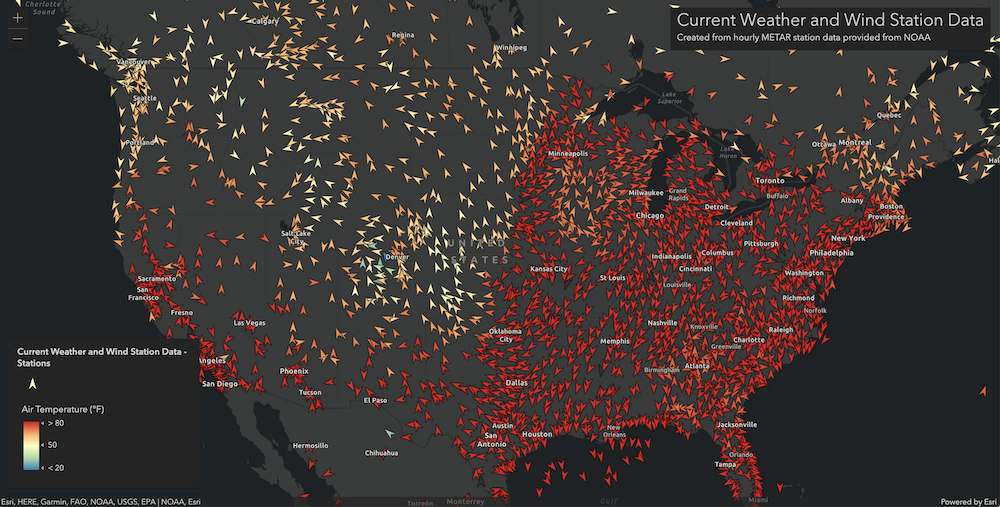
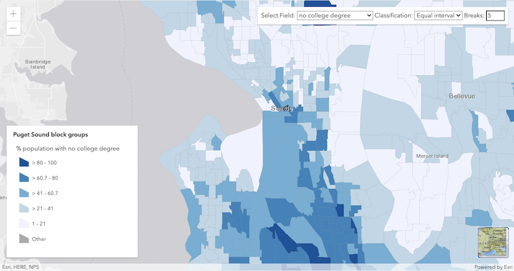
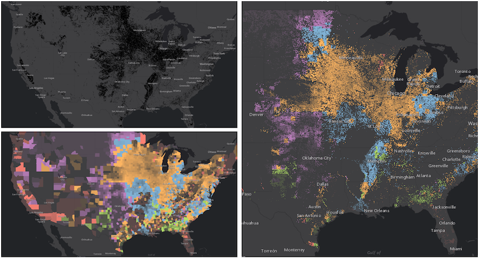
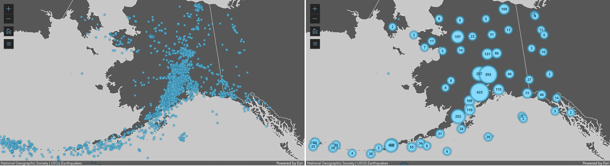

<!-- .slide: data-background="../reveal.js/img/2021/dev-summit/bg-1.png" -->
<!-- .slide: class="title" -->
<h1 style="text-align: left; font-size: 50px;">ArcGIS API for JavaScript: Working with Your Data Using the Feature Layer</h1>
<p style="text-align: left; font-size: 30px;">Bjorn Svensson and Anne Fitz</p>
<p style="text-align: left; font-size: 30px;">slides: <a href="https://arcg.is/WGXqn"><code>https://arcg.is/WGXqn<code></a></p>

----
<!-- .slide: data-background="../reveal.js/img/2021/dev-summit/bg-4.png" -->
### Introductions

<div style="width:47%; float:left; padding: 10px;">
</img>
</img>
Bjorn Svensson
</div>
<div style="width:47%; float:right; border-left: 2px solid white; padding: 10px;">
</img>
</img>
Anne Fitz
</div>

----
<!-- .slide: data-background="../reveal.js/img/2021/dev-summit/bg-3.png" -->

### First time using the ArcGIS API for JavaScript?

 Watch [Getting Started with Web Development and the ArcGIS API for JavaScript](https://www.youtube.com/watch?v=zQTkkFUhzLI) to understand the basics, then come back to this presentation!

[https://arcg.is/0vrHnv](https://arcg.is/0vrHnv)

----
<!-- .slide: data-background="../reveal.js/img/2021/dev-summit/bg-3.png" -->
### Agenda

- FeatureLayer: what, why, how
- Visualization
  - Rendering
  - Layer blending
  - Clustering
- Labeling
- Layer vs. LayerView
  - Querying
  - Filtering
  - Highlighting
- Editing Features

----

### What is the FeatureLayer?

* More than 20+ different [layers](https://developers.arcgis.com/javascript/latest/api-reference/esri-layers-Layer.html)
* FeatureLayer:
  * for query, visualize, analyze
  * clientside rendering
  * Service-based and file-based
  <!--* By service type: MapServer, ImageServer, FeatureServer, StreamServer-->

----

### What's so special about FeatureLayer?

[
](https://developers.arcgis.com/javascript/latest/api-reference/esri-layers-FeatureLayer.html)

- Works with your data as features
- Can be used for editing
- Allows for dynamic styling and interactive workflows
- Support for client-side filtering, querying, and statistics

----

### Adding a FeatureLayer to your map

**Sources**

- Feature services or map services
- Feature collections
- Portal item (from ArcGIS Online or Enterprise)

```js
const layer = new FeatureLayer({
  url: "https://<url to my server>/FeatureServer/0",
  // portalItem: {
  //    id: "item id from portal"
  // },
  //renderer: { ... },
  //popupTemplate: { ... },
});

map.add(layer);
```

----

### Adding a FeatureLayer to your map

<p style="font-size:smaller;color:gray;font-style:italic">Unemployment in the United States by postal codes</p>

<iframe width="1200" height="500" frameborder="0" scrolling="no" marginheight="0" marginwidth="0"
    src="Demos/part1-intro/add-featurelayer.html"/>

----

### Adding a FeatureLayer to your map: definitionExpression

Limit the data retrieved from the feature service

```js
layer.definitionExpression = "STATE_NAME='California'";
```

<a href="Demos/part1-intro/add-featurelayer-california.html" target="_blank"></img></a>

----

<h3 style="margin-top:-35px"> <a href="https://developers.arcgis.com/javascript/latest/guide/visualization-overview/" target="_blank">Visualization:</a> Rendering</h4>

<p style="margin:0">A renderer defines how the FeatureLayer is drawn.</p>

|[SimpleRenderer](https://developers.arcgis.com/javascript/latest/api-reference/esri-renderers-SimpleRenderer.html)| [ClassBreaksRenderer](https://developers.arcgis.com/javascript/latest/api-reference/esri-renderers-ClassBreaksRenderer.html)| [UniqueValueRenderer](https://developers.arcgis.com/javascript/latest/api-reference/esri-renderers-UniqueValueRenderer.html) |
|----------|----------|----------|
| [](https://developers.arcgis.com/javascript/latest/sample-code/visualization-location-simple/index.html) | [](https://developers.arcgis.com/javascript/latest/sample-code/visualization-classbreaks/index.html) | [](https://developers.arcgis.com/javascript/latest/sample-code/visualization-location-types/index.html) |

| [HeatmapRenderer](https://developers.arcgis.com/javascript/latest/api-reference/esri-renderers-HeatmapRenderer.html) | [DotDensityRenderer](https://developers.arcgis.com/javascript/latest/api-reference/esri-renderers-DotDensityRenderer.html) | [DictionaryRenderer](https://developers.arcgis.com/javascript/latest/api-reference/esri-renderers-DictionaryRenderer.html) |
|----------|----------|----------|
| [](https://developers.arcgis.com/javascript/latest/sample-code/visualization-heatmap-scale/index.html) | [](https://developers.arcgis.com/javascript/latest/sample-code/visualization-dot-density/index.html) | [](https://developers.arcgis.com/javascript/latest/sample-code/visualization-dictionary/index.html) |

----

### Visualization: SimpleRenderer Demo

Visualize streets with [SimpleLineSymbol](https://developers.arcgis.com/javascript/latest/api-reference/esri-symbols-SimpleLineSymbol.html)

<a href="Demos/part2-visualization/simplerenderer.html" target="_blank"></img>

```js
const streets = new FeatureLayer({
  portalItem: {
    id: "fad8da699eb1439ea9e20a8b97cffa7f"
  },
  renderer: {
    type: "simple",
    symbol: {
      // autocasts as SimpleLineSymbol
      type: "simple-line",
      size: 1,
      color: "black"
    }
  }
});
```
</a>

----

### Visualization: UniqueValueRenderer Demo

Visualize one-way streets with [CIMSymbols](https://developers.arcgis.com/javascript/latest/api-reference/esri-symbols-CIMSymbol.html)

<a href="Demos/part2-visualization/cim-uniquevaluerenderer.html" target="_blank"></img>

```js
const streets = new FeatureLayer({
  portalItem: {
    id: "fad8da699eb1439ea9e20a8b97cffa7f"
  },
  renderer: {
    type: "unique-value",
    field: "oneway",
    defaultSymbol: {
      type: "simple-line"
    },
    uniqueValueInfos: [{
      value: "yes",
      symbol: { // CIMSymbol
        type: "cim",
        data: { ... }
      }
    }]
  }
});
```
</a>

----

### Visualization: Visual Variables

**[Visual variables](https://developers.arcgis.com/javascript/latest/api-reference/esri-renderers-SimpleRenderer.html#visualVariables)**: used to create data-driven thematic visualizations
<ul>
 <li>size</li>
 <li>color</li>
 <li>opacity</li>
 <li>rotation</li>
</ul>
</div>
<div style="width:65%; float:right;">
<a href="Demos/part2-visualization/visualvariables.html" target="_blank"></img></a>
</div>

----

### Visualization: Smart Mapping

[Smart Mapping APIs](https://developers.arcgis.com/javascript/latest/guide/visualization-overview/#smart-mapping-apis): generate renderers with "smart" default symbols based on the summary statistics of the dataset and the basemap

<a href="https://developers.arcgis.com/javascript/latest/sample-code/sandbox/index.html?sample=visualization-sm-classbreaks" target="_blank"></img></a>

----

### Visualization: Layer blending

`featureLayer.blendMode`: a method of blending layers together to create interesting effects or produce a seemingly new layer

<a href="Demos/part2-visualization/layerblend.html" target="_blank"></img></a>

----

### Visualization: Clustering

**Clustering:** a method of reducing points by grouping them into clusters based on their spatial proximity to one another.

<a href="https://developers.arcgis.com/javascript/latest/sample-code/featurereduction-cluster/index.html" target="_blank"></img></a>

----

### Labeling

<!--Label features to show relevant information at a glance.-->

<!--[Guide topic](https://developers.arcgis.com/javascript/latest/guide/labeling/index.html)-->

* FeatureLayer has [labelingInfo](https://developers.arcgis.com/javascript/latest/api-reference/esri-layers-FeatureLayer.html#labelingInfo) and [labelsVisible](https://developers.arcgis.com/javascript/latest/api-reference/esri-layers-FeatureLayer.html#labelsVisible) properties
  * labelingInfo is an array of [LabelClass](https://https://developers.arcgis.com/javascript/latest/api-reference/esri-layers-support-LabelClass.html)
    * with labelExpressionInfo, labelPlacement, and symbol properties
    * where symbol is [TextSymbol](https://developers.arcgis.com/javascript/latest/api-reference/esri-symbols-TextSymbol.html) or [LabelSymbol3D](https://developers.arcgis.com/javascript/latest/api-reference/esri-symbols-LabelSymbol3D.html)

* or a PortalItem with labels defined

<!--
  Click above API Reference, then on to samples.
  The labelingInfo property is specified as an array of LabelClass objects, which contains the labelExpressionInfo, labelPlacement, and TextSymbol.
  The TextSymbol class supports altering the color, font, halo, and other properties of the label graphic. Labeling is supported for Points, Polylines, and Polygons.

  font set
-->

----

### Labeling demos

----

### Layer vs. LayerView

- **LayerView**
  - Created when a layer is added to a MapView or SceneView
  - Responsible for rendering features in the view
  - Allows query, filter, and highlighting on the client-side


----

### Querying

- Attribute queries
  - select only features passing a WHERE SQL clause
- Spatial queries
  - select only features passing a spatial filter
- Statistic queries
  - returns statistics about the selected features

----

### Server-side querying

Bring features from your data into the web browser.

<a href="Demos/part4-querying/serverside.html" target="_blank"></img></a>

[Query features](https://developers.arcgis.com/javascript/latest/sample-code/sandbox/index.html?sample=featurelayer-query-basic)

```js
featureLayer.queryFeatures({
    geometry: point
}).then(function(featureSet){
    // do something with the results
});
```

[Query attachments](https://developers.arcgis.com/javascript/latest/sample-code/sandbox/index.html?sample=query-attachments)

```js
featureLayer.queryAttachments()
```

[Query related features](https://developers.arcgis.com/javascript/latest/sample-code/sandbox/index.html?sample=query-related-features)

```js
featureLayer.queryRelatedFeatures()
```

----

### Client-side querying

Query data already in the web browser.
`featureLayerView.queryFeatures()`

- Really fast
- Avoids round-trips to the server
- Only works with available features
- Make sure you have all the attributes you need

<a href="Demos/part4-querying/clientside.html" target="_blank">Demo</a></br>
<a href="Demos/part4-querying/clientside-hover.html" target="_blank">Demo - hover</a>

----

### Highlight
<a href="https://developers.arcgis.com/javascript/latest/sample-code/sandbox/index.html?sample=highlight-scenelayer" target="_blank"></img></a>

<div style="width: 49%;">
  <ul>
    <li>Highlight features on the LayerView</li>
    <li>Maintain a handle to the current highlight</li>
    <li>Highlight options: color, opacity, halo</li>
  </ul>
</div>
</br></br>

 ```js
if (highlight){
  highlight.remove();
}
highlight = layerView.highlight(result.features);
```

----

### Filtering

- Define the filter criteria
- Define the style for filtered features
- Apply the filter to the LayerView
- For server-side filtering, use `definitionExpression`

<a href="Demos/part4-querying/filter.html" target="_blank"></img></a>

----

### Editing

Updating features directly from the web browser.

How do I know if I can edit features?

- Rest supported operations
- ArcGIS Online/Portal settings
- ArcGIS Server manager
- FeatureLayer.capabilities

----

### Editing

- FeatureLayer.applyEdits()
- Editor widget
- FeatureTable widget

----

### Editing demos

----
<!-- .slide: data-background="../reveal.js/img/2021/dev-summit/bg-5.png" -->
### Please provide your feedback for this session by clicking on the session survey link directly below the video.

----
<!-- .slide: data-background="../reveal.js/img/2021/dev-summit/bg-5.png" -->
