<!-- .slide: data-background="../reveal.js/img/2021/dev-summit/bg-1.png" -->
<!-- .slide: class="title" -->
<h1 style="text-align: left; font-size: 50px;">ArcGIS API for JavaScript: Working with Your Data Using the Feature Layer</h1>
<p style="text-align: left; font-size: 30px;">Anne Fitz and Bjorn Svensson</p>
<p style="text-align: left; font-size: 30px;">slides: <a href="https://arcg.is/1zevmz"><code>https://arcg.is/1zevmz<code></a></p>

----
<!-- .slide: data-background="../reveal.js/img/2021/dev-summit/bg-4.png" -->
### Introductions

<div style="width:47%; float:left; padding: 10px;">
</img>
</img>
Anne Fitz
</div>
<div style="width:47%; float:right; border-left: 2px solid white; padding: 10px;">
</img>
</img>
Bjorn Svensson
</div>

----
<!-- .slide: data-background="../reveal.js/img/2021/dev-summit/bg-3.png" -->
### Agenda

- Intro to FeatureLayer
- Performance
- Visualization
- Labeling
- Interacting with the FeatureLayer
  - Querying
  - Filtering
  - Highlighting
- Editing features

----

### What is the FeatureLayer?

* More than 20+ different [layers](https://developers.arcgis.com/javascript/latest/api-reference/esri-layers-Layer.html)
* FeatureLayer:
  * for query, visualize, analyze
  * clientside rendering
  * Service-based and file-based
  <!--* By service type: MapServer, ImageServer, FeatureServer, StreamServer-->

----

### What's so special about FeatureLayer?

[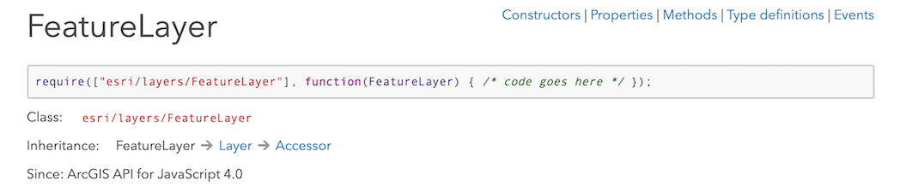
](https://developers.arcgis.com/javascript/latest/api-reference/esri-layers-FeatureLayer.html)

- Works with your data as features
- Can be used for editing
- Allows for dynamic styling and interactive workflows
- Support for client-side filtering, querying, and statistics

----

### Adding a FeatureLayer to your map

**Sources**

- Feature services or map services
- [Feature collections](https://developers.arcgis.com/javascript/latest/sample-code/sandbox/index.html?sample=layers-featurelayer-collection)
- Portal item (from ArcGIS Online or Enterprise)

```js
const layer = new FeatureLayer({
  url: "https://<url to my server>/FeatureServer/0",
  // portalItem: {
  //    id: "item id from portal"
  // },
  //renderer: { ... },
  //popupTemplate: { ... },
});

map.add(layer);
```

----

### Adding a FeatureLayer to your map

<p style="font-size:smaller;color:gray;font-style:italic">Vacant housing in the United States by county</p>

<a href="Demos/part1-intro/add-featurelayer.html">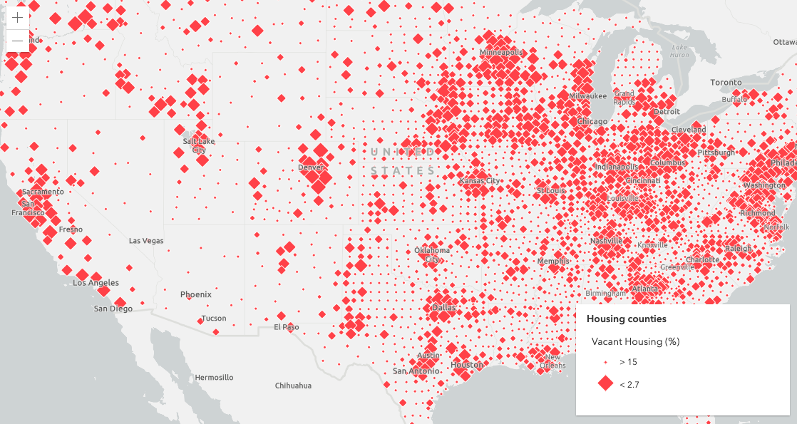</a>

----

### FeatureLayer network performance

----

### API optimized for performance

* Compression: [brotli](https://en.wikipedia.org/wiki/Brotli)
* Data format: [prototype buffers](https://developers.google.com/protocol-buffers)
* Cacheabiliy
  * consistent, predictable application queries
  * tiling
    * dynamic feature tiles
  * [cache-control](https://developer.mozilla.org/en-US/docs/Web/HTTP/Headers/Cache-Control) for caching in browser and CDN

----

[demo](Demos/part2-performance/index.html)

----

### Your settings for optimal cacheability

* disable editing on the feature layer
  * or create non-editable view layer
* set share level to everyone
* increase cache time

----

<h3 style="margin-top:-35px"> <a href="https://developers.arcgis.com/javascript/latest/guide/visualization-overview/" target="_blank">Visualization:</a> Rendering</h4>

<p style="margin:0">A renderer defines how the FeatureLayer is drawn.</p>

|[SimpleRenderer](https://developers.arcgis.com/javascript/latest/api-reference/esri-renderers-SimpleRenderer.html)| [ClassBreaksRenderer](https://developers.arcgis.com/javascript/latest/api-reference/esri-renderers-ClassBreaksRenderer.html)| [UniqueValueRenderer](https://developers.arcgis.com/javascript/latest/api-reference/esri-renderers-UniqueValueRenderer.html) |
|----------|----------|----------|
| [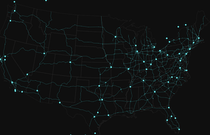](https://developers.arcgis.com/javascript/latest/sample-code/visualization-location-simple/index.html) | [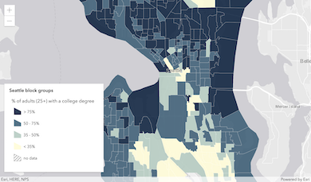](https://developers.arcgis.com/javascript/latest/sample-code/visualization-classbreaks/index.html) | [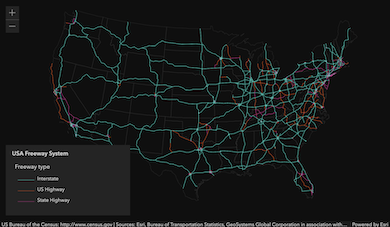](https://developers.arcgis.com/javascript/latest/sample-code/visualization-location-types/index.html) |

| [HeatmapRenderer](https://developers.arcgis.com/javascript/latest/api-reference/esri-renderers-HeatmapRenderer.html) | [DotDensityRenderer](https://developers.arcgis.com/javascript/latest/api-reference/esri-renderers-DotDensityRenderer.html) | [DictionaryRenderer](https://developers.arcgis.com/javascript/latest/api-reference/esri-renderers-DictionaryRenderer.html) |
|----------|----------|----------|
| [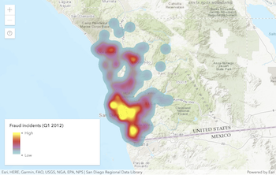](https://developers.arcgis.com/javascript/latest/sample-code/visualization-heatmap-scale/index.html) | [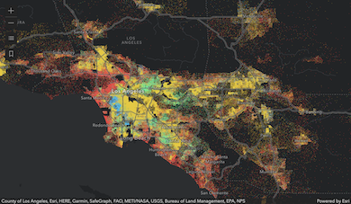](https://developers.arcgis.com/javascript/latest/sample-code/visualization-dot-density/index.html) | [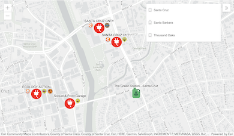](https://developers.arcgis.com/javascript/latest/sample-code/visualization-dictionary/index.html) |

----

### Visualization: Rendering Demos

<a href="Demos/part3-visualization/class-breaks.html" target="_blank">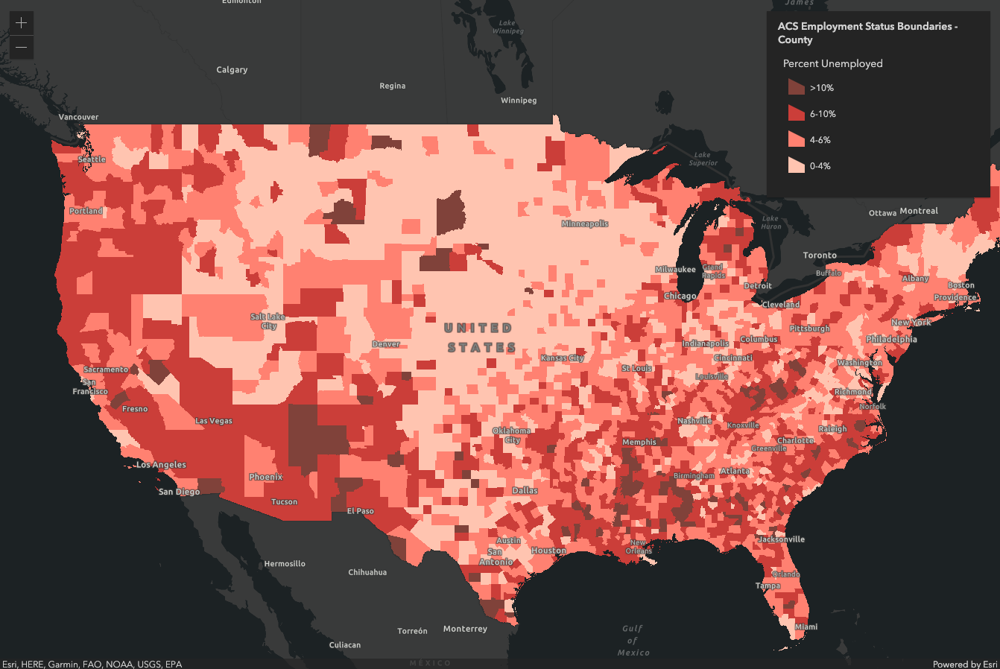</img></a>

- [Simple Renderer](Demos/part3-visualization/simple-renderer.html)
- [Class Breaks](Demos/part3-visualization/class-breaks.html)
- [Visual Variables](Demos/part3-visualization/visual-variables.html)

----

### Visualization: Smart Mapping

[Smart Mapping APIs](https://developers.arcgis.com/javascript/latest/guide/visualization-overview/#smart-mapping-apis): generate renderers with "smart" default symbols based on the summary statistics of the dataset and the basemap
<a href="Demos/part3-visualization/smartmapping.html" target="_blank">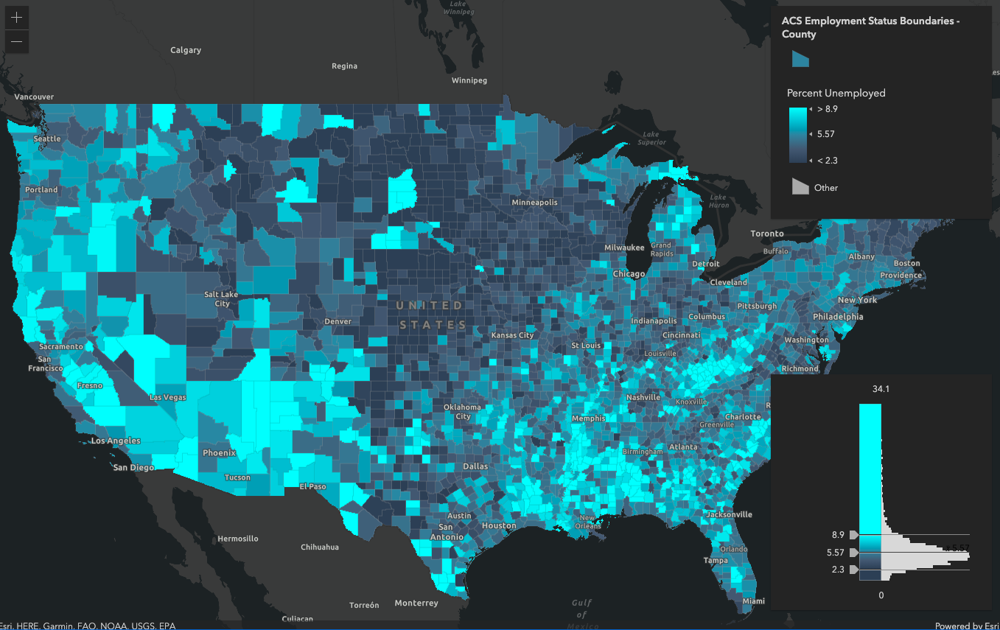</img></a>

----

### Visualization: Clustering

**Clustering:** a method of reducing points by grouping them into clusters based on their spatial proximity to one another.

<a href="Demos/part3-visualization/clustering.html" target="_blank">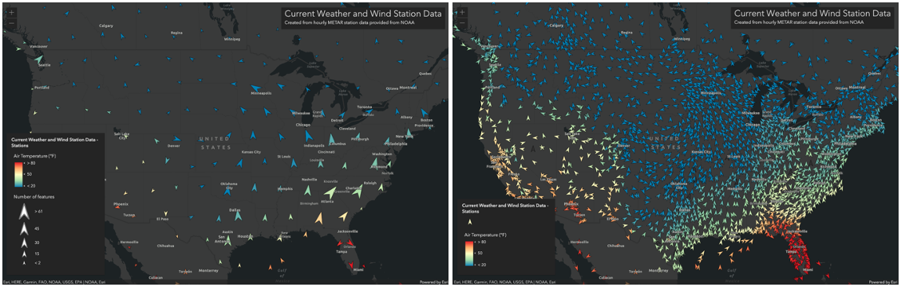</img></a>

----

### Labeling

<!--Label features to show relevant information at a glance.-->

<!--[Guide topic](https://developers.arcgis.com/javascript/latest/guide/labeling/index.html)-->

* FeatureLayer has [labelingInfo](https://developers.arcgis.com/javascript/latest/api-reference/esri-layers-FeatureLayer.html#labelingInfo) and [labelsVisible](https://developers.arcgis.com/javascript/latest/api-reference/esri-layers-FeatureLayer.html#labelsVisible) properties
  * labelingInfo is an array of [LabelClass](https://https://developers.arcgis.com/javascript/latest/api-reference/esri-layers-support-LabelClass.html) with 
    * labelExpressionInfo, 
    * labelPlacement, 
    * min and max scale,
    * and symbol properties
      * where symbol is [TextSymbol](https://developers.arcgis.com/javascript/latest/api-reference/esri-symbols-TextSymbol.html) or [LabelSymbol3D](https://developers.arcgis.com/javascript/latest/api-reference/esri-symbols-LabelSymbol3D.html)

* or a PortalItem with labels defined

----

[demo](Demos/part4-labeling/index.html)

----

### Interacting with your layer

- [Popups](https://developers.arcgis.com/javascript/latest/sample-code/sandbox/index.html?sample=intro-popuptemplate)
- Widgets ([Legend](https://developers.arcgis.com/javascript/latest/api-reference/esri-widgets-Legend.html), [LayerList](https://developers.arcgis.com/javascript/latest/api-reference/esri-widgets-LayerList.html), etc)
- Highlighting, querying, filtering

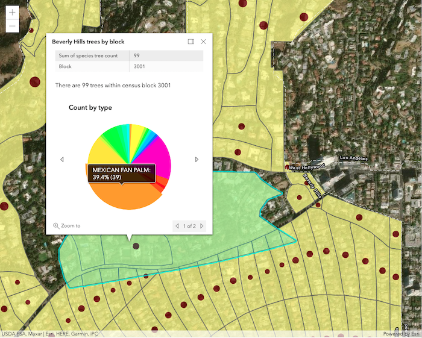
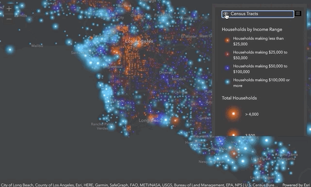

----

### Layer vs. LayerView

- **LayerView**
  - Created when a layer is added to a MapView or SceneView
  - Responsible for rendering features in the view
  - Allows query, filter, and highlighting on the client-side

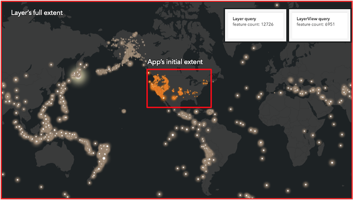

----

### Querying

- Attribute queries
  - select only features passing a WHERE SQL clause
- Spatial queries
  - select only features passing a spatial filter
- Statistic queries
  - returns statistics about the selected features

----
### Server-side querying

Bring features from your data into the web browser.

<a href="Demos/part5-querying/serverside.html" target="_blank">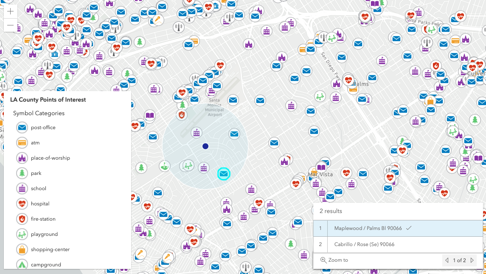</img></a>

[Query features](https://developers.arcgis.com/javascript/latest/sample-code/sandbox/index.html?sample=featurelayer-query-basic)

```js
featureLayer.queryFeatures({
    geometry: point
}).then(function(featureSet){
    // do something with the results
});
```

[Query attachments](https://developers.arcgis.com/javascript/latest/sample-code/sandbox/index.html?sample=query-attachments)

```js
featureLayer.queryAttachments()
```

[Query related features](https://developers.arcgis.com/javascript/latest/sample-code/sandbox/index.html?sample=query-related-features)

```js
featureLayer.queryRelatedFeatures()
```

----

### Client-side querying

Query data already in the web browser.
`featureLayerView.queryFeatures()`

- Really fast
- Avoids round-trips to the server
- Only works with available features
- Make sure you have all the attributes you need

<a href="Demos/part5-querying/clientside.html" target="_blank">Demo</a></br>
<a href="Demos/part5-querying/clientside-hover.html" target="_blank">Demo - hover</a>

----

### Highlight
<a href="https://developers.arcgis.com/javascript/latest/sample-code/sandbox/index.html?sample=view-hittest" target="_blank">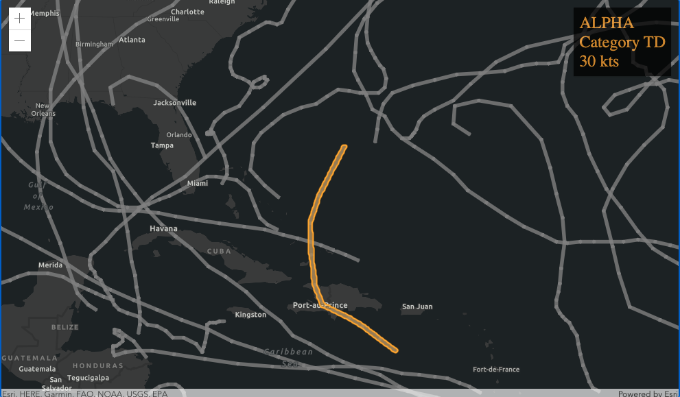</img></a>

<div style="width: 49%;">
  <ul>
    <li>Highlight features on the LayerView</li>
    <li>Maintain a handle to the current highlight</li>
    <li>Highlight options: color, opacity, halo</li>
  </ul>
</div>
</br></br>

 ```js
if (highlight){
  highlight.remove();
}
highlight = layerView.highlight(result.features);
```

----

### Filtering

- Define the filter criteria
- Define the style for filtered features
- Apply the filter to the LayerView
- For server-side filtering, use [`definitionExpression`](Demos/part5-querying/definitionExpression.html)

<a href="Demos/part5-querying/filter.html" target="_blank">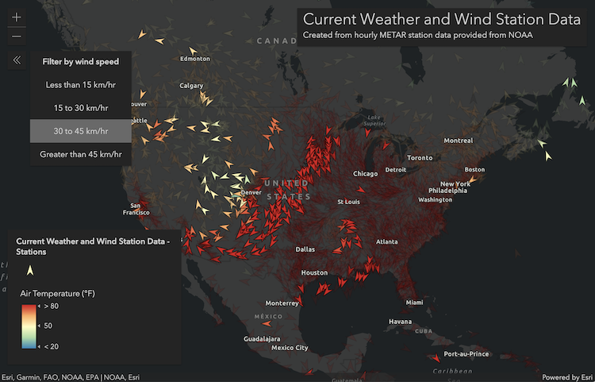</img></a>

----

### Editing

Updating features directly from the web browser.

How do I know if I can edit features?

- Rest supported operations
- ArcGIS Online/Portal settings
- ArcGIS Server manager
- FeatureLayer.capabilities

----

### Editing

- FeatureLayer.applyEdits()
- Editor widget
- FeatureTable widget

----

### Editing demos

----
<!-- .slide: data-background="../reveal.js/img/2021/dev-summit/bg-5.png" -->
### Please provide your feedback for this session by clicking on the session survey link directly below the video.

----
<!-- .slide: data-background="../reveal.js/img/2021/dev-summit/bg-5.png" -->
