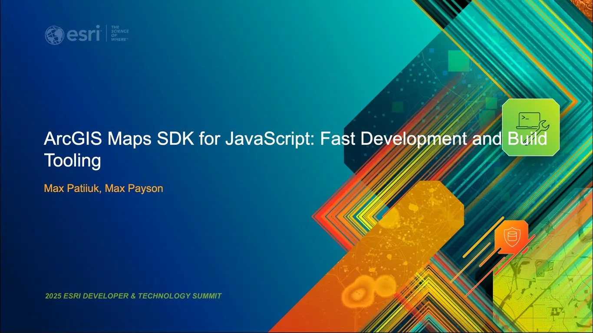

# ArcGIS Maps SDK for JavaScript: Fast Development and Build Tooling

Learn how Esri's development teams are leveraging modern tools like Vite to
build fast, dynamic Web GIS applications. With features such as lazy loading,
client-side routing, hot module replacement, and lightning-fast builds, Vite
streamlines the entire development workflow from bundling to deployment. Paired
with Vitest for testing, these tools help ensure that your apps are both
high-performing and production-ready.

When: Wednesday, March 12 | 4:00 PM - 5:00 PM PDT

Where: Smoketree C | Palm Springs Convention Center

Presenters: [Max Payson](https://github.com/mpayson) &
[Max Patiiuk](https://github.com/maxpatiiuk)

Presented at [Esri Developer Summit 2025](https://devtechsummit2025.esri.com/).

[Slides](https://maxpatiiuk.github.io/esri-dev-summit-presentations/2025/build-tooling)

## Resources

### Vite ⚡

- [Final demo app](./demo/final)
- [Basic demo apo](./demo/1-javascript)
  - Run `npm create vite` to create a new Vite project
- [Documentation](https://vitejs.dev/)
  - [Publishing guide](https://vite.dev/guide/static-deploy)

### React ⚛️

- [Demo app](./demo/2-react)
  - [Get started steps](./demo/2-react/README.md#key-changes-from-1-javascript)
- [Documentation](https://reactjs.org/)

### Calcite Design System 💎

- [Demo app](./demo/3-web-components)
  - [Get started steps](./demo/3-web-components/README.md#key-changes-from-2-react)
- [Documentation](https://developers.arcgis.com/calcite-design-system)
- [GitHub](https://github.com/Esri/calcite-components)
- [Esri Community](https://community.esri.com/t5/calcite-design-system/ct-p/calcite-design-system)
- [Custom Calcite themes](https://esrips.github.io/calcite-theme-editor/#theme)
- [Calcite demo samples](https://github.com/EsriDevEvents/dev-tech-summit-demo-templates)

### ArcGIS Maps SDK for JavaScript 📍

- [Demo app](./demo/final)
  - [Get started steps](./demo/3-web-components/README.md#key-changes-from-2-react)
- [Documentation](https://developers.arcgis.com/javascript)
- [Get started (for NPM)](https://developers.arcgis.com/javascript/latest/get-started-npm/)
- [Maps SDK Resources](https://github.com/Esri/jsapi-resources)
- [React sample app](https://github.com/Esri/jsapi-resources/tree/main/component-samples/map-components/samples/react)

### TypeScript 🦾

- [Demo app](./demo/4-typescript)
  - [Get started steps](./demo/4-typescript/README.md#key-changes-from-3-web-components)
- [Documentation](https://www.typescriptlang.org)
- [Guide to using ArcGIS Maps SDK for JavaScript with TypeScript](https://developers.arcgis.com/javascript/latest/guide/typescript-setup/)
- VS Code extension:
  - [Pretty TypeScript Errors](https://marketplace.visualstudio.com/items?itemName=yoavbls.pretty-ts-errors)

### ESLint 🚩

- [Demo app](./demo/5-eslint)
  - [Get started steps](./demo/5-eslint/README.md#key-changes-from-4-typescript)
- [Documentation](https://eslint.org/)
- VS Code extension:
  - [ESLint extension for VS Code](https://marketplace.visualstudio.com/items?itemName=dbaeumer.vscode-eslint)
