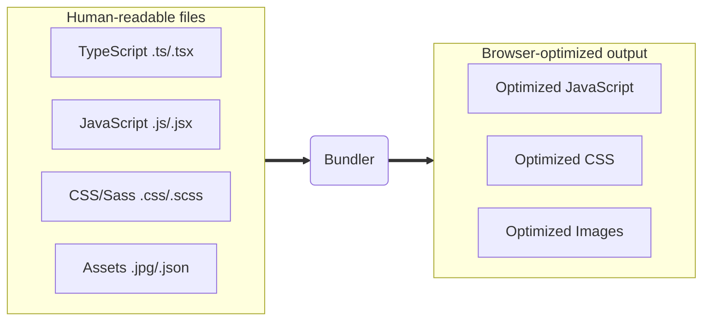

## ArcGIS Maps SDK for JavaScript:<br>Fast Development and Build Tooling

Anne Fitz, Esri <br>
Rich Ruh, Esri

---
is: feedback
---

---

# Agenda

- Introduction to build tools
- Building an app
  - Get started with Vite
  - Add dependencies
  - Use TypeScript and ESLint
  - Publish the app
- Enhance the app
  - Lazy load parts of the application
  - Add tests with Vitest
  - Add custom plugins

<!--
Quick tour of app building...based on what Esri teams are doing
-->

---

# What are build tools?

Build tools transform the code that is easiest for developers to write into code
that is most performant for the browser to run.



---

# Build tool benefits

- Improve development experience (live updates...)
- Enable modern syntax features and dependencies
- Make testing code simpler
- Optimize performance (reduce file sizes, split bundles...)
- Allow extending capabilities with plugins

---

# Examples of build tools

- Vite
- Parcel
- Webpack

---

# Vite

- Most popular build tool today
- Used by many Esri teams
- Great developer experience
- Large and rapidly growing community

---
layout: center
---

# Demo: [Get started with Vite](https://github.com/annelfitz/DevSummit-presentations/tree/main/EUDS-2025/build-tooling/demo/1-javascript)

<!--
- Create a Vite starter project
- Start the dev server and show how simple it is to use
- Show index.html, main.js, Splash.js, package.json
  - Similar to no-build-step apps
- Show live update
-->

---

## React

- As app grows, it benefits from more structure
- The most popular JavaScript library for building dynamic user-interfaces
- Build anything out of small Components
- JSX (JavaScript Syntax Extension).
  - `return <h1>Hello World! 👋</h1>;`
  - JavaScript code in HTML-like syntax

---
layout: center
---

# Demo: [Add basic React 19](https://github.com/annelfitz/DevSummit-presentations/tree/main/EUDS-2025/build-tooling/demo/2-react)

---

# Calcite Design System

- Library of 50 reusable web components
- Provides consistent and accessible UI out of the box
- Works with any framework

---
layout: center
---

# Demo: [Add Calcite and JS Maps SDK components](https://github.com/annelfitz/DevSummit-presentations/tree/main/EUDS-2025/build-tooling/demo/3-web-components)

---

## TypeScript

Most developers see great benefit from adding TypeScript to their projects:

> TypeScript: catch your bugs before your users do

- Auto-magically ✨ provides better autocomplete and inline documentation
- Helps with code refactoring
- Encourages self-documenting code
- Essential part of every ArcGIS Online app at Esri

<!--
That's a lot of promises - lets see TypeScript in action by adding it to our
project.
-->

---
layout: center
---

# Demo: [Adopt TypeScript](https://github.com/annelfitz/DevSummit-presentations/tree/main/EUDS-2025/build-tooling/demo/4-typescript)

---

# ESLint

- Optional, but very helpful on projects with multiple developers
- Enforce consistent code style on your team
- Catch some issues that TypeScript can't (like bad coding patterns)
- Autofix some issues for you

---
layout: center
---

# Demo: [Use ESLint](https://github.com/annelfitz/DevSummit-presentations/tree/main/EUDS-2025/build-tooling/demo/5-eslint)

---

# Publishing

- You learned Vite, React, Calcite, Map Components, TypeScript, ESLint - now
  what?
- Let's publish the app!

<!--
That's it for the main tools Esri teams use to build their apps
Now comes the question - how do you get your app out there?
-->

---

# Demo: Publishing the app

Do a production build:

```sh
npm run build
```

Outputs static files that can be published to any hosting provider (GitHub
Pages, Vercel) or local server (NGINX, Microsoft IIS, Apache)

<!--
- The output is index.html and static files - same as no-build-step apps
  - Show off single minified JavaScript file
- Can be deployed to any hosting provider (GitHub Pages, Vercel) or local server (NGINX, Microsoft IIS, Apache)
-->

---

# Fun fact

These slides are built with Vite and hosted on GitHub Pages! ✨

(with help from [Slidev](https://sli.dev/))

---

# Demo summaries

- **Vite ⚡** simplifies the development workflow
- **React ⚛️** makes it easy to do complex things in a maintainable way
- **Calcite 💎** provides ready to use user interface components
- **TypeScript 🦾** catches your bugs before your users do
- **ESLint 🚩** ensures the code style stays consistent

---
layout: intro
---

# Enhance the app

---

# ArcGIS Maps SDK for JavaScript

- Powerful GIS mapping library
- Now simpler to use thanks to web components

---

# Lazy loading

- Only load source files when needed
- Split app into multiple entry points
- Simplest split: by page or route

---
layout: center
---

# Demo: [Lazy loading & routes with React Router](https://github.com/annelfitz/DevSummit-presentations/tree/main/EUDS-2025/build-tooling/demo/6-routes)

---

# Testing

Testing is great, Vitest is also great!

- Fast with familiar API
- Supports modern language features
- Run tests in Node or the browser
- Direct integration with Vite

---
layout: center
---

# Demo: [Add tests with Vitest](https://github.com/annelfitz/DevSummit-presentations/tree/main/EUDS-2025/build-tooling/demo/7-tests)

---

# Custom plugins

- Vite plugins are flexible and easy to write
- Powerful way to enhance builds or developer workflows

---
layout: center
---

# Demo: [Add custom plugins](https://github.com/annelfitz/DevSummit-presentations/tree/main/EUDS-2025/build-tooling/demo/8-plugins)

---

# Demo summaries

- **Lazy loading 🚀** improves app performance
- **Testing with Vitest 🧪** makes it easy to write and maintain tests
- **Custom plugins 🔌** provides a powerful way to enhance workflows

---

# In conclusion...

- Build tools like Vite help your app grow and stay maintainable
- They offer plenty of control and developer experience enhancements
- They pair well with testing tools like Vitest to ensure your app is
  production-ready

---
layout: center
---

# Questions?

ArcGIS Maps SDK for JavaScript: Fast Development and Build Tooling

Demos and additional resources available at:
[arcg.is/esri-2025-build-tooling](https://arcg.is/esri-2025-build-tooling)


<!--
If you wish to dive deeper, you can find our demos and
additional resources at the URL above, or you can scan the QR code.
-->

---
src: ../.meta/footer.md
---
